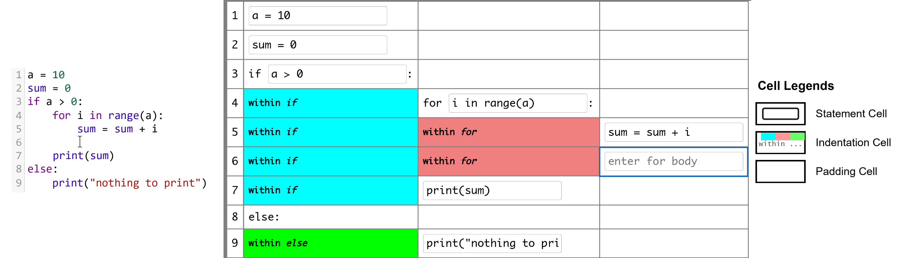

# Grid-Coding: An Accessible, Efficient, and Structured Coding Paradigm for Blind and Low Vision Programmers (UIST 2022 Best Paper)

This repository contains the source code for [Grid-Coding](https://dl.acm.org/doi/abs/10.1145/3526113.3545620 "link to Grid-Coding") paper published in UIST 2022 and received the Best Paper award. Grid-Coding is a spreadsheet-like coding paradigm that enables blind and low vision programmers to read, write, and navigate code efficiently. The figure below shows how a piece of Python code is represented in Grid-Coding. On the left side, the code is written in a visual studio code, which contains line numbers, syntax highlighting, and whitespace-based indentation, that are inaccessible to blind and low-vision (BLV) programmers. On the right side, the same code is represented in Grid-Coding, which contains cells, rows, and columns. Each row represents a line of code, and each column represents a statement at a different scope or level. The first column contains line numbers as part of the code, and the subsequent columns represent the code at different levels of indentation. Whitespaces are replaced by Indentation Cells that provide contextual information about the code such as within if, within else, and within for. Users can edit the code inside the grid one cell at a time, and the grid grows dynamically as new lines and levels are added to the code.

We created a web-based environment that supports an implementation of Grid-Coding for Python programming, which we call Ally IDE. It contains a Text Editor, Grid Editor, and a Code Output window. Try the publicly available [Ally IDE](https://ally-ide.herokuapp.com/ "link to ally ide").

	

		<h2>Table of Contents</h2>
		<ul>
			<li id="li_demo"> <a href="#demo">Video Demo of Ally IDE</a> </li>
			<li id="nav_panels"> <a href="#panels">Overview of Ally IDE</a> </li>
			<ul>
				<li id="li_lim"><a href="#lim">Limitations</a></li>
			</ul>
			<li id="li_installation"> <a href="#installation">Installation</a> </li>
			<li><a href="#shortcuts_and_cues">Common Shortcuts and Cues</a></li>
			<ul>
				<li id="nav_common_shortcuts"> <a href="#common_shortcuts">Common Shortcuts</a> </li>
				<li> <a href="#common_audio_cues">Common Audio Cues</a> </li>
			</ul>
			<li id="li_text_editor"> <a href="#text_editor">Text Editor</a> </li>
			<li id="li_table_editor"> <a href="#table_editor">Grid Editor</a> </li>
			<ul>
				<li> <a href="#nav_and_editing_code">Navigating and Editing Code</a> </li>
				<li> <a href="#auto_complete_code">Auto Completion of Variable and Code block in Grid Editor</a>
				</li>
				<li> <a href="#dedent">Going out of Indentation in Grid Editor</a> </li>
			</ul>
			<li id="li_code_output"> <a href="#output_view">Code Output Window</a></li>
			<li id="li_context_menu"> <a href="#context_menu">Context Menu</a></li>
			<ul>
				<li> <a href="#context_menu_1">Context Menu for Text/Grid Editor and Tree View</a>
				</li>
				<li> <a href="#context_menu_2">Context Menu for Bookmarks and Code Output</a> </li>
			</ul>
		</ul>
	

	

		

			<h2>Video Demo of Ally IDE</h2>
			<video width="75%" height="Auto" controls>
				<source src="demo/demo.mp4" type="video/mp4">
			</video>
			 
			<a href="#li_demo">Back to Table of Contents </a>
		

		

			<h2>Installation</h2>
			

			The project is completely built with HTML, CSS, and JavaScript. It does not require any specific installation. To run the project, simply open the <code>index.html</code> file in a web browser. It is also possible to host the project on a web server. A simple server is the `http-server` package from npm. To install it, run the following command:
			<ol>
				<li>Make sure you have Node.js in your system. Install Node.js from <a href="https://nodejs.org/en/download/">https://nodejs.org/en/download/</a></li>
				<li>Install http-server package by running the following command in the terminal:
					<code>npm install --global http-server</code>
				</li>
				<li>Run the server by running the following command in the terminal:
					<code>http-server</code>
				</li>
				<li>Open the browser and go to url shown in the terminal</li>
			</ol>
			The project requires setting up a backend for executing Python code and seeing the result in Code Output. The backend code is available in the <a href="https://github.com/ehteshamulhaque71/grid-coding-backend">Grid-Coding-Backend</a> repository. Follow the instructions in the README file of the repository to set up the backend. Change the <code>apiUrl</code> and <code>apiEndpoint</code> variables in the <code>js/compile.js</code> file to point to the backend url and endpoint for execution. You can also setup your own backend or use any other backend service to execute the code by updating the API call in the <code>js/compile.js</code> file accordingly.
			

			<a href="#li_installation">Back to Table of Contents </a>
		

		

			<h2>Overview of Ally IDE</h2>
			

				<strong> Ally IDE </strong> is a web-based, accessible Python IDE for non-visual programming. It is
				still a research prototype and may have bugs. It is tested in Chrome Web browser with NVDA and
				VoiceOver screen readers.
			

			

				Ally IDE has five components: two editors, two views, and an output window. The shortcut to select
				each component is Control plus a number from one to five. Each component serves a special purpose
				and is well-integrated to minimize the need for visual cues during programming.
			

			

				The first editor is a plain <strong>Text Editor</strong>, which is similar to writing code in a
				Notepad or TextEdit.
				The shortcut to select Text Editor is Control + 1.
				The second editor is a spreadsheet-like interface to read and write code in grid cells.
				We call it <strong>Grid Editor</strong> (shortcut: Control + 2).
				The user can seamlessly transition between Text and Table Editors to read/write codes.
			

			

				<strong>Code Output</strong> window (shortcut: Control + 5) shows the textual output.
				To compile/run the code, a user presses ALT + ENTER.
			

			

				<strong>Context Menu</strong> (shortcut: Control + 0) provides a list of helpful information, such
				as the current
				line and scope, frequently used actions like bookmarking a line, and changing the default settings.
				Finally, Ally Editor provides different audio cues to keep the user informed and oriented at all
				times.
			

			
 The following sections describe each component and associated shortcuts in detail.
			

			<h3 id="lim">Limitations</h3>
			

				As Ally IDE is still a research prototype and it has several limitations.

			<ul>
				<li>
					The IDE works best in <strong>Web browser with NVDA screen readers</strong>.
				</li>
				<li>
					The IDE behaves best when interacted with a keyboard. Using a mouse may cause unexpected behavior.
				</li>
				<li>
					The Python interpreter (version: 3.10.4) supports the builtin functions and modules, and two more
					packages - numpy and pandas. More support are on the way!
				</li>
				<li>
					The IDE does not support importing and exporting files.
				</li>
				<li>
					The IDE does not support any input value through a console (i.e., input() function does not work).
				</li>
			</ul>
			
We are constantly trying to improve the prototype and provide more features. For updates, please keep an eye on this page.

			<a href="#li_lim">Back to Table of Contents </a>
			

			<h2 id="shortcuts_and_cues">Common Shortcuts and Cues</h2>
			<h3 id="common_shortcuts">Shortcuts for Navigation</h3>
			<table style="border: 1px solid black;">
				<thead>
					<tr>
						<th style="border: 1px solid black;">
							Shortcut Key
						</th>
						<th style="border: 1px solid black;">
							Purpose
						</th>
					</tr>
				</thead>
				<tbody>
					<tr>
						<td style="border: 1px solid black;">Control + 0</td>
						<td style="border: 1px solid black;">Open Context Menu or Right-click menu</td>
					</tr>
					<tr>
						<td style="border: 1px solid black;">Control + 1</td>
						<td style="border: 1px solid black;">Switch to Text Editor. The cursor is set at the current
							line</td>
					</tr>
					<tr>
						<td style="border: 1px solid black;">Control + 2</td>
						<td style="border: 1px solid black;">Switch to Grid Editor. The cursor is set at the
							current line</td>
					</tr>
					<tr>
						<td style="border: 1px solid black;">Control + 5</td>
						<td style="border: 1px solid black;">Switch to Code Output Window </td>
					</tr>
					<tr>
						<td style="border: 1px solid black;">Control + l</td>
						<td style="border: 1px solid black;">Announce the line number, level of the statement, and
							the name of the view at the current cursor</td>
					</tr>
					<tr>
						<td style="border: 1px solid black;">Control + g</td>
						<td style="border: 1px solid black;">Go to a particular line. A user types the line number
							and presses ENTER to commit</td>
					</tr>
					<tr>
						<td style="border: 1px solid black;">ALT + ENTER</td>
						<td style="border: 1px solid black;">Compile or Run the code. The cursor is taken to the
							output window by default </td>
					</tr>
				</tbody>
			</table>
			<h3 id="shortcut_texteditor">Shortcuts for Interaction</h3>
			<table style="border: 1px solid black;">
				<thead>
					<tr>
						<th style="border: 1px solid black;">Shortcut Key</th>
						<th style="border: 1px solid black;">Text Editor</th>
						<th style="border: 1px solid black;">Grid Editor</th>
						<th style="border: 1px solid black;">Code Output Window</th>
					</tr>
				</thead>
				<tbody>
					<tr>
						<td style="border: 1px solid black;">UP Arrow</td>
						<td style="border: 1px solid black;">Move the cursor to previous line</td>
						<td style="border: 1px solid black;">
							Go to the cell above the current cell at the same column
						</td>
						<td style="border: 1px solid black;">Move the cursor to previous line</td>
					</tr>
					<tr>
						<td style="border: 1px solid black;">DOWN Arrow</td>
						<td style="border: 1px solid black;">Move the cursor to next line</td>
						<td style="border: 1px solid black;">
							Go to the cell below the current cell at the same column
						</td>
						<td style="border: 1px solid black;">Move the cursor to next line</td>
					</tr>
					<tr>
						<td style="border: 1px solid black;">LEFT Arrow</td>
						<td style="border: 1px solid black;">Move the cursor to previous character</td>
						<td style="border: 1px solid black;">
							Go to the left cell in the same row of the current cell
						</td>
						<td style="border: 1px solid black;">Move the cursor to previous character</td>
					</tr>
					<tr>
						<td style="border: 1px solid black;">RIGHT Arrow</td>
						<td style="border: 1px solid black;">Move the cursor to next character</td>
						<td style="border: 1px solid black;">
							Go to the right cell in the same row of the current cell
						</td>
						<td style="border: 1px solid black;">Move the cursor to next character</td>
					</tr>
					<tr>
						<td style="border: 1px solid black;">ENTER</td>
						<td style="border: 1px solid black;">Create a new line. If current line is empty, then
							ignore</td>
						<td style="border: 1px solid black;">
							Make a cell editable (if allowed)
						</td>
						<td style="border: 1px solid black;"> No Action</td>
					</tr>
					<tr>
						<td style="border: 1px solid black;">BACKSPACE</td>
						<td style="border: 1px solid black;">Remove the character (or indetation) at the cursor
							position.
						</td>
						<td style="border: 1px solid black;">
							In Navigation mode, remove the current statement cell and the corresponding row. Block
							Statements and the first stamentent inside a block cannot be removed. Cursor will point
							to the statement cell in the previous row.
						</td>
						<td style="border: 1px solid black;">No Action</td>
					</tr>
					<tr>
						<td style="border: 1px solid black;">ESCAPE</td>
						<td style="border: 1px solid black;">No Action</td>
						<td style="border: 1px solid black;">
							Make a statement cell non-editable, or dismiss the suggestion drop-down
						</td>
						<td style="border: 1px solid black;">No Action</td>
					</tr>
					<tr>
						<td style="border: 1px solid black;">DELETE</td>
						<td style="border: 1px solid black;">Delete the character at the cursor position</td>
						<td style="border: 1px solid black;">Delete the character in a statement cell while editing
						</td>
						<td style="border: 1px solid black;">No Action</td>
					</tr>
					<tr>
						<td style="border: 1px solid black;">PAGE UP</td>
						<td style="border: 1px solid black;">Move cursor to the first line</td>
						<td style="border: 1px solid black;">
							From an Empty cell, go to the nearest Statement cell or Indentation cell in the upward
							direction at the same level.
							From an Indentation cell, go to the Statement cell that creates the indentation.
							From a Statement cell, skip over consecutive statement cells or Blank Cells in the
							upward direction at the same level.
						</td>
						<td style="border: 1px solid black;">No Action</td>
					</tr>
					<tr>
						<td style="border: 1px solid black;">PAGE DOWN</td>
						<td style="border: 1px solid black;">Move cursor to the last line</td>
						<td style="border: 1px solid black;">
							From an Empty cell or Indentation Cell, go to the nearest Statement cell in the downward
							direction at the same level.
							From a Statement cell, skip over consecutive Statement cells, Indentation Cells or Blank
							Cells in the
							downward direction at the same level.
						</td>
						<td style="border: 1px solid black;">No Action</td>
					</tr>
					<tr>
						<td style="border: 1px solid black;">HOME</td>
						<td style="border: 1px solid black;">Move cursor to the start of current line</td>
						<td style="border: 1px solid black;">
							From an Empty cell, go to the Statement cell in the same row.
							From a Statement cell or Indentation cell, go to the Line Number cell in the same row.
						</td>
						<td style="border: 1px solid black;">No Action</td>
					</tr>
					<tr>
						<td style="border: 1px solid black;">END</td>
						<td style="border: 1px solid black;">Move cursor to the end of current line</td>
						<td style="border: 1px solid black;">
							From an Indentation cell or Line Number cell, go to the Statement cell in the same row.
							From a Statement cell, Empty cell, go to the Right Most cell in the same row.
						</td>
						<td style="border: 1px solid black;">No Action</td>
					</tr>
				</tbody>
			</table>
			<h3 id="common_audio_cues">Audio Cues</h3>
			

				Ally IDE provides a real-time error cue (a beep sound) when editing the code in Grid Editor to
				indicate a syntax
				error. This cue is provided when the current editing cell contains a syntax error and the user tries
				to go out of Edit mode or create a new cell by pressing Enter.
				In addition, a periodical error alert every 45 seconds (configurable) will notify the user of any
				error
				with a prompt, e.g., 'Error at
				Line 3'. The user can disable these cues from the Settings.
				A list of other audio cues is described in the following table.
			

			<table style="border: 1px solid black;">
				<thead>
					<tr>
						<th style="border: 1px solid black;">Interaction</th>
						<th style="border: 1px solid black;">Audio Cue</th>
					</tr>
				</thead>
				<tbody>
					<tr>
						<td style="border: 1px solid black;">Making a cell editable/Going to the child node or
							statement</td>
						<td style="border: 1px solid black;">
							<audio controls class="audio-cues">
								<source src="sounds/enter.flac" type="audio/flac">
							</audio>
						</td>
					</tr>
					<tr>
						<td style="border: 1px solid black;">Making a cell non-editable/Going to the parent
							statement or node</td>
						<td style="border: 1px solid black;">
							<audio controls>
								<source src="sounds/leave.flac" type="audio/flac">
							</audio>
						</td>
					</tr>
					<tr>
						<td style="border: 1px solid black;">Hitting a table boundary</td>
						<td style="border: 1px solid black;">
							<audio controls>
								<source src="sounds/end.wav" type="audio/wav">
							</audio>
						</td>
					</tr>
					<tr>
						<td style="border: 1px solid black;">Navigating with arrows</td>
						<td style="border: 1px solid black;">
							<audio controls>
								<source src="sounds/travarse.mp3" type="audio/mpeg">
							</audio>
						</td>
					</tr>
					<tr>
						<td style="border: 1px solid black;">Editing a table cell</td>
						<td style="border: 1px solid black;">
							<audio controls>
								<source src="sounds/edit.wav" type="audio/wav">
							</audio>
						</td>
					</tr>
					<tr>
						<td style="border: 1px solid black;">Auto-completing a block</td>
						<td style="border: 1px solid black;">
							<audio controls>
								<source src="sounds/block-start.wav" type="audio/wav">
							</audio>
						</td>
					</tr>
					<tr>
						<td style="border: 1px solid black;">Switching Editors or Views</td>
						<td style="border: 1px solid black;">
							<audio controls>
								<source src="sounds/switch.wav" type="audio/wav">
							</audio>
						</td>
					</tr>
					<tr>
						<td style="border: 1px solid black;">Error Beep</td>
						<td style="border: 1px solid black;">
							<audio controls>
								<source src="sounds/error.wav" type="audio/wav">
							</audio>
						</td>
					</tr>
					<tr>
						<td style="border: 1px solid black;">Code is executing</td>
						<td style="border: 1px solid black;">
							<audio controls>
								<source src="sounds/running.mp3" type="audio/mpeg">
							</audio>
						</td>
					</tr>
				</tbody>
			</table>
			<a href="#nav_common_shortcuts">Back to Table of Contents</a>
			

		

		

			<h2>Text Editor (Control + 1)</h2>
			

				Text Editor is similar to Nodepad to edit code. It has the following features:
			

			<ul>
				<li> <strong>Indentation Size:</strong> 1 Space (by default). Tabs are replaced by Spaces.
					Indentation
					size can be changed from the Settings in <a href="#context_menu">Context
						Menu.</a></li>
				<li> <strong>Auto Indentation:</strong> Enabled (by default). This feature can be disabled from the
					Settings in <a href="#context_menu">Context Menu</a>.
					Backspace key will remove the spaces equal to the indentation size.</li>
				<li> <strong>No consecutive Empty New Lines:</strong> Consecutive empty new lines are confusing.
					Thus,
					the editor prevents pressing Enter on an empty line to create additional empty lines. </li>
			</ul>
			<a href="#li_text_editor">Back to Table of Contents</a>
			

		

		

			<h2>Grid Editor (Control + 2)</h2>
			

				Grid Editor is the core component of Ally Editor. It is a spreadsheet-like tabular environment for
				reading and writing code in grid cells. Each row contains a single line of code, and each column
				represents a statement at a different scope or level.
				The first column corresponds to the code at the global scope (level: 1).
				Conditions and Loops create a new scope or level.
				For example, the body of an <em>if block </em> creates a new scope. In this case, it is at level 2.
				The body of a <em> for block </em> within this <em>if block</em> will create another scope, level 3.
			

			

				The table grows dynamically as new lines and levels are added to the code.
				The right-most column will contain the code at the highest level.
				If a source code has ten lines and the highest level is four, Grid Editor will have ten rows and
				four columns -- in total, forty cells.
				The table cells can be of three types:
			<ul>
				<li> <strong>Statement cells</strong> : Contain actual code statement. For example, a variable
					declaration or an assignment expression. These cells are editable so that the user make change
					to a statement.
				</li>
				<li> <strong> Indentation cells</strong>: Represent an indentation in the code. These cells are
					mostly non-editable to preserve the scope of a code block (e.g., If condition, for loop).
					Indentation cells are read out with semantically meaningful information, such as <em> within if
					</em>, <em> within else</em>, and <em> within for</em>.
					An indentation cell always precedes a statement cell in a row.
				</li>
				<li> <strong>Empty cells </strong>: Pads the statement cells to the right (if necessary) to make the
					number of columns equals to the highest level in any rows. These cells are non-editable, read
					out as <em> BLANK </em>, and used only to maintain the tabular structure.
				</li>
			</ul>
			

			

				The following sections describe how to use different features of Grid Editor.
			

			<h3 id="nav_and_editing_code">Navigating and Editing Code in Grid Editor</h3>
			

				Grid Editor has two mode of operations: (a) <em> Navigation mode </em> to read and explore code
				risk-free; and <em> Edit mode </em> to make changes in the code.
			<ul>
				<li> <strong>Navigation mode </strong>: This is the default mode and allows users to navigate table
					cells using four arrow keys. A user can press ENTER to get out of this mode and edit a statement
					cell.
				</li>
				<li> <strong>Edit mode </strong>: In this mode, a user can edit a statement in a single cell or
					press Enter to create a new statement (e.g. row). The LEFT and RIGHT arrow keys move the cursor
					between the characters within a cell, and the UP and DOWN arrow keys are ignored. To get out of
					this mode, users must press ESCAPE.
				</li>
			</ul>
			

			<h3 id="auto_complete_code">Auto Completion of Variable and Code block in Grid Editor</h3>
			

				While editing, Grid Editor provides a suggestion drop-down list with variables that match the typed
				text. The user can choose variable or a code block (e.g., <em> If block </em>, <em> For block </em>)
				from this list by pressing UP or DOWN arrow and commit the selection by pressing ENTER.
			

			

				If a code block is selected, Grid Editor automatically inserts necessary keywords and creates an
				indentation cell in the next row. Then, a user types the conditions and presses ENTER to go to the
				body automatically.
			

			

				A user can also write a block (e.g., if/loop block) manually.
				For example, to write an <em>if block</em>, a user types if keyword, the condition, colon, and
				finally, presses ENTER. Then, Grid Editor creates an indentation cell (e.g., 'within if') in the
				next row and brings the cursor to the appropriate statement cell to continue typing the body of that
				block.
			

			<h3 id="dedent">Going out of Indentation in Grid Editor</h3>
			

				First, a user presses ESCAPE to get in the Navigation mode, then presses LEFT arrow to go to the
				target cell, and finally presses ENTER to edit (if allowed). For example, the first indentation cell
				after a block cannot be edited because doing so creates an indentation error.
				The plain Text Editor is recommended over the Grid Editor to remove nested code blocks or
				restructure a code.
			

			<a href="#li_table_editor">Back to Table of Contents</a>
		

	

	

		<h2>Code Output Window (Control + 5)</h2>
		

			The Code Output window shows the textual output of the code when executed (shortcut: ALT+ ENTER).
			When the output is available, the cursor is set to the first line of the output.
			The user can press the arrow keys to navigate the output.
			Ally IDE parses syntax error messages and offers a special context menu (shortcut: Control + 0) to jump
			to the corresponding error line at Text Editor, Grid Editor, or Code Tree.
		

		<a href="#li_code_output">Back to Table of Contents</a>
	

	

		<h2>Context Menu (Control + 0)</h2>
		

			Context Menu (shortcut: Control + 0) provides a list of helpful information, such as the current
			line and scope, frequently used actions like bookmarking a line and changing the default settings.
			Depending on the selected Editor or View, the Context Menu can provide different options. The following
			two tables describe these options.
		

		<h3 id="context_menu_1">Context Menu for Text/Grid Editor and Tree View</h3>
		<table style="border: 1px solid black;">
			<thead>
				<tr>
					<th style="border: 1px solid black;">Context Menu Item</th>
					<th style="border: 1px solid black;">Description</th>
				</tr>
			</thead>
			<tbody>
				<tr>
					<td style="border: 1px solid black;">Line and Level information</td>
					<td style="border: 1px solid black;">Announces the line number and indentation level of the
						statement at the cursor location</td>
				</tr>
				<tr>
					<td style="border: 1px solid black;">Scope information</td>
					<td style="border: 1px solid black;">Announces the scope of the statement at the cursor location
					</td>
				</tr>
				<tr>
					<td style="border: 1px solid black;">Jump to First Line</td>
					<td style="border: 1px solid black;">Go to the first stamentent of the code in the current
						Editor/View
					</td>
				</tr>
				<tr>
					<td style="border: 1px solid black;">Jump to Last Line</td>
					<td style="border: 1px solid black;">Go to the last stamentent of the code in the current
						Editor/View
					</td>
				</tr>
				<tr>
					<td style="border: 1px solid black;">Go to a Line</td>
					<td style="border: 1px solid black;">Go to the a particular line of the code in the current
						Editor/View.
						A dialog box will prompt the user to provide a line number. The user presses ENTER to go to
						that line.</td>
				</tr>
				<tr>
					<td style="border: 1px solid black;">Settings</td>
					<td style="border: 1px solid black;">Open the Settings dialog to change the
						default behavior of Ally IDE. The user presses <em>Save Settings</em> to commit changes</td>
				</tr>
				<tr>
					<td style="border: 1px solid black;">Run Code</td>
					<td style="border: 1px solid black;">Execute the source code and the cursor will be
						automatically moved to the first line in Code Output</td>
				</tr>
				<tr>
					<td style="border: 1px solid black;">Help</td>
					<td style="border: 1px solid black;">Shows the documentation and shortcuts of Ally IDE in a
						Dialog Window</td>
				</tr>
			</tbody>
		</table>
		<h3 id="context_menu_2">Context Menu for Code Output</h3>
		<table style="border: 1px solid black;">
			<thead>
				<tr>
					<th style="border: 1px solid black;">Without Error</th>
					<th style="border: 1px solid black;">With Error</th>
				</tr>
			</thead>
			<tbody>
				<tr>
					<td style="border: 1px solid black;">Go to Current Line in Text Editor (Ctrl + 1)</td>
					<td style="border: 1px solid black;">Go to Error Line in Text Editor (Ctrl + 1)</td>
				</tr>
				<tr>
					<td style="border: 1px solid black;">Go to Current Line in Grid Editor (Ctrl + 2)
					</td>
					<td style="border: 1px solid black;">Go to Error Line in Grid Editor (Ctrl + 2)</td>
				</tr>
				<tr>
					<td style="border: 1px solid black;">Help</td>
					<td style="border: 1px solid black;">Help</td>
				</tr>
			</tbody>
		</table>
		<a href="#li_context_menu">Back to Table of Contents</a>
	

